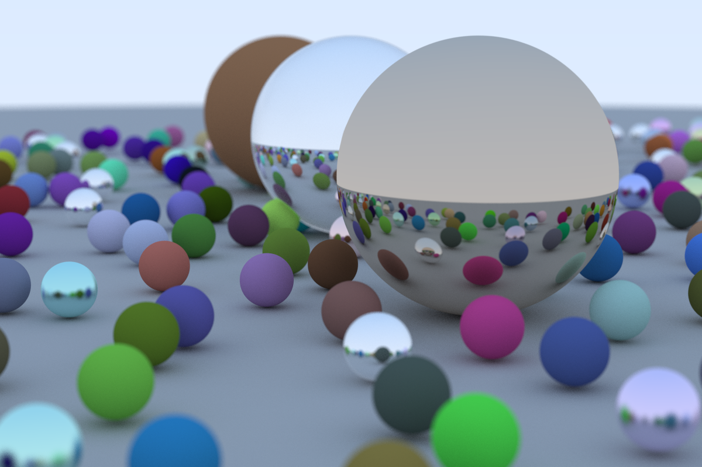

# RRaytracing - Rust Raytracing

RRaytracing is minimal raytracing implementation with both CLI and GUI user interfaces. RRaytracing implementation follows [Ray Tracing In One Weekend book](https://raytracing.github.io/).



## Features

- Three different materials with variable characteristics
    1. Lambertian
    2. Metal
    3. Glass (dielectric)

- Variable anti-aliasing amount
- Defocus blur
- Positionable camera (currently hardcoded position)

## Ideas for further development

- Unit tests
- Benchmarks
- Performance improvement
- Multithreading
- Replace "unwrap()" calls with actual error handling
- Changing scene from GUI
- Moving camera in GUI
- Adding textures
- Making scene variable from GUI (+possibly saving/loading scenes)

## Usage

Project can be built/ran with standard cargo commands. 
```
cargo build --release // Will create executables for both CLI and GUI in target/release folder
cargo run --bin gui // Running gui in debug mode
cargo run --bin renderer // Running CLI in debug mode
cargo run --bin renderer -- -h // To see CLI options
```
